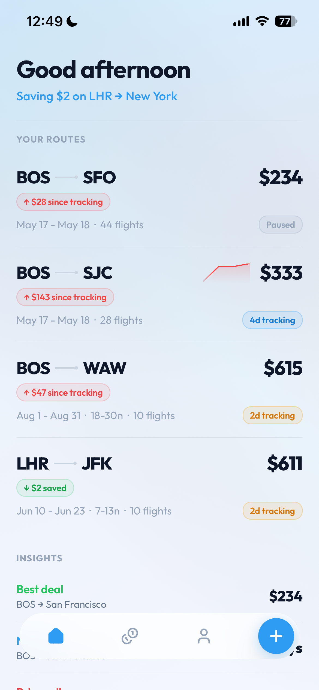
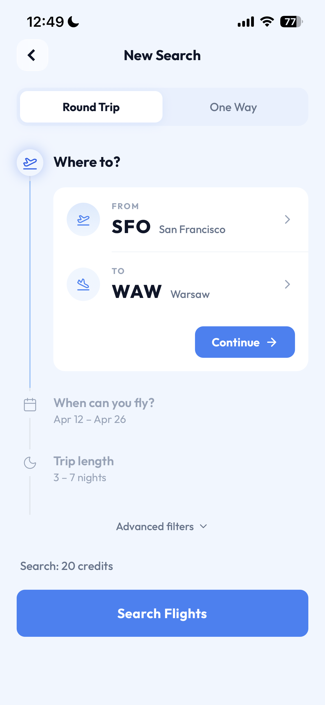
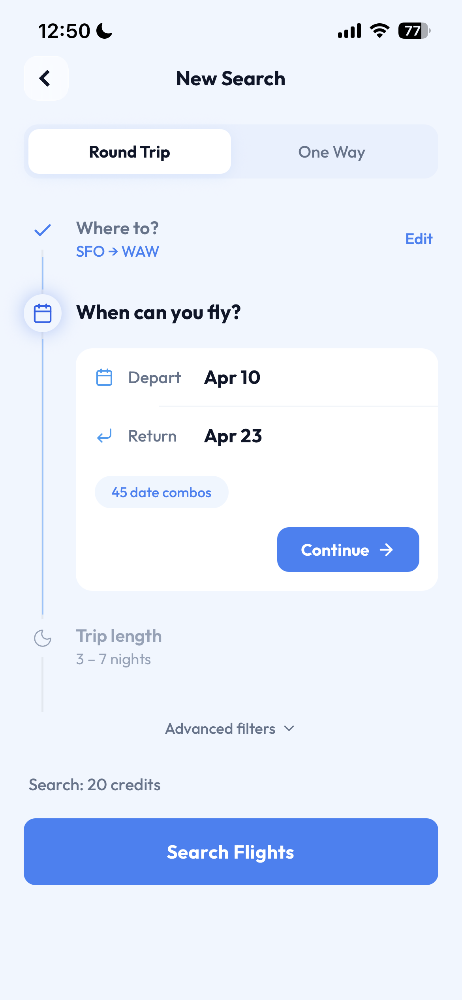
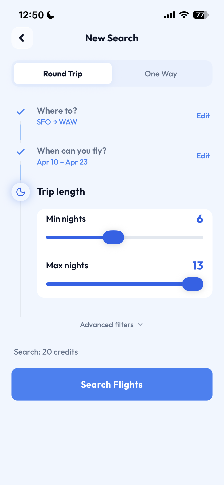
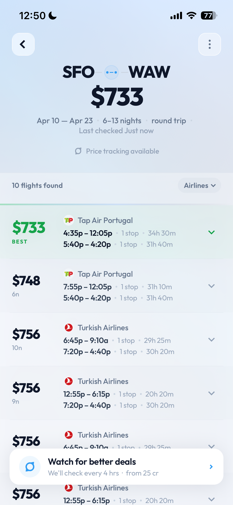
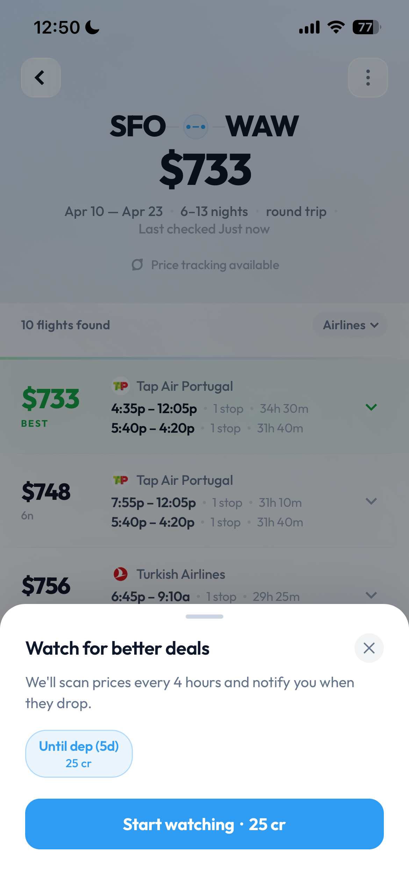
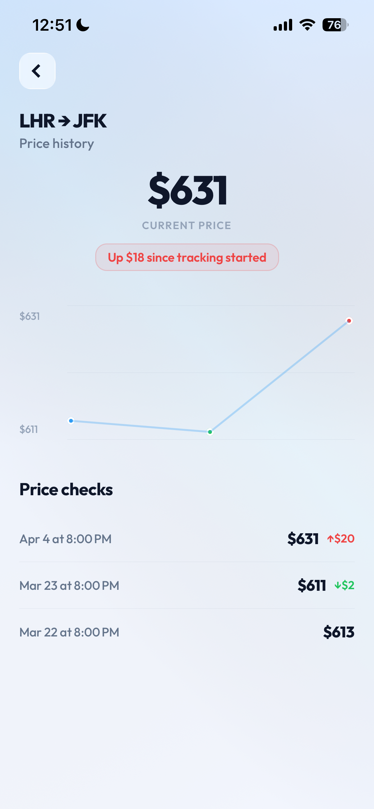

# SkyLens - Smart Flight Price Tracker

A full-stack iOS app that finds the cheapest flights across flexible date ranges and automatically tracks prices over time, alerting users when fares drop.

Instead of manually checking flights day by day, SkyLens searches **all possible date combinations** within a travel window and surfaces the best deals — then keeps watching prices so you never miss a drop.

## Screenshots

<p align="center">
  
  
  
  
</p>
<p align="center">
  
  
  
</p>

## What It Does

**The problem:** Booking a round-trip flight with flexible dates means manually searching dozens of departure/return combinations to find the cheapest option. Most flight search tools only check one date pair at a time.

**The solution:** Enter your origin, destination, travel window, and preferred trip length — SkyLens generates every valid date combination (often 50-200+), queries them all, and ranks results by price. One search replaces hours of manual comparison.

Once you find a route, you can enable **price tracking** — the app checks prices every 4 hours using a sentinel strategy (minimizing API calls while catching every price change) and sends push notifications when fares drop.

## Features

- **Flexible date search** — Search across a date range with configurable trip length (e.g., "3-7 nights between Apr 10-23"), generating all valid date combos automatically
- **Smart price tracking** — Automated price monitoring every 4 hours with push notifications on price drops
- **Sentinel strategy** — Efficient price checking that samples 3-4 representative date combos first and only does a full scan when a price change is detected, minimizing API costs
- **Price history** — Visual chart and log of every price check, showing trends over time
- **Advanced filters** — Filter by number of stops, max flight duration, specific airlines (include/exclude), and carry-on bags — applied at the API level for accurate results
- **Credits system** — Usage-based pricing with credit packs, scaled by search complexity (number of date combos)
- **Social auth** — Sign in with Apple or Google, no passwords
- **24h deduplication** — Identical searches within 24 hours return cached results at no cost

## Tech Stack

### Backend
- **Runtime:** Node.js + Express + TypeScript
- **Database:** PostgreSQL with Prisma 7 ORM
- **Auth:** JWT with refresh token rotation (Apple + Google OAuth)
- **Flight data:** SerpAPI (Google Flights)
- **Scheduling:** node-cron for automated price checks
- **Validation:** Zod for request validation
- **Security:** Helmet, CORS, rate limiting, serializable transaction isolation for credit operations
- **Logging:** Pino (structured JSON logging)
- **Testing:** Vitest + Supertest

### Frontend
- **Framework:** React Native (Expo SDK 54) with Expo Router
- **UI:** Custom components, Lucide icons, Bottom Sheet, Reanimated animations
- **State:** React Context (auth, credits)
- **Payments:** react-native-iap (Apple In-App Purchases)
- **Notifications:** Expo Push Notifications

### Architecture Highlights
- Cron-based price worker with **sentinel sampling** — checks a small subset of date combos first, triggers full re-scan only on price movement
- Credit deductions use **serializable transaction isolation** to prevent race conditions
- Failed API calls trigger **automatic credit refunds**
- Refresh tokens implement **rotation with family-based revocation** for security
- 1,488 airline names mapped to IATA codes via OpenFlights dataset

## Project Structure

```
backend/
  prisma/           # Schema & migrations
  src/
    controllers/    # Route handlers
    services/       # Business logic (auth, search, credits, flights)
    workers/        # Price check cron job
    routes/         # Express route definitions
    config/         # Database & app config
    types/          # Shared TypeScript types

frontend/
  app/              # Expo Router screens
  src/
    components/     # Reusable UI components
    context/        # Auth & credits providers
    services/       # API client
    types/          # Shared types
```
